视频：[B站系列视频](https://www.bilibili.com/video/BV1Ce411379e)

# 第一节：开源图深度学习框架的机遇与挑战

亚马逊云科技上海人工智能研究院 资深应用科学家 王敏捷

## 图数据无处不在

药物与分子结构、社交网络、用户-产品、知识图谱

## 图机器学习任务分类

- 节点预测：分析一个用过户的爱好（节点分类）
- 链接预测：知识图谱补全，推荐系统；判断交互的类型
- 社区（子图）预测：检测金融欺诈行为
- 图性质预测：图生产模型，预测分子或者化合物性质

## 图机器学习任务案例

### 社交平台水军检测

- 通过用户行为：点赞 or 恶意评论

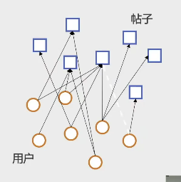

### 药物重定位知识图谱（DRKG）

- 源码：DRKG  [https://github.com/gnn4dr/DRKG](https://github.com/gnn4dr/DRKG)
- 描述：合并6个不同的药物信息**数据集**
- 13个类别共100k个节点；100+类别共6M条边
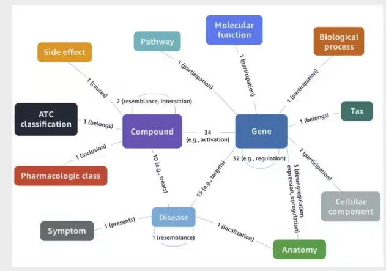
- 效果：通过药物重定位，即搜索能作用于相似的疾病蛋白的药物化合物，通过图数据分析所推荐41种药物中，有11 种已被用于临床治疗。

> 方案估计：将药品信息与疾病蛋白构建成一个知识图谱，再将新的蛋白的序列作为输入，将包含该序列或与该序列类似的蛋白找到，再将相关药物推出。

## 图+深度学习=图神经网络 GNN

用于学习点、边或者图的向量表示的一类神经网络。
消息传递：边上计算、节点计算
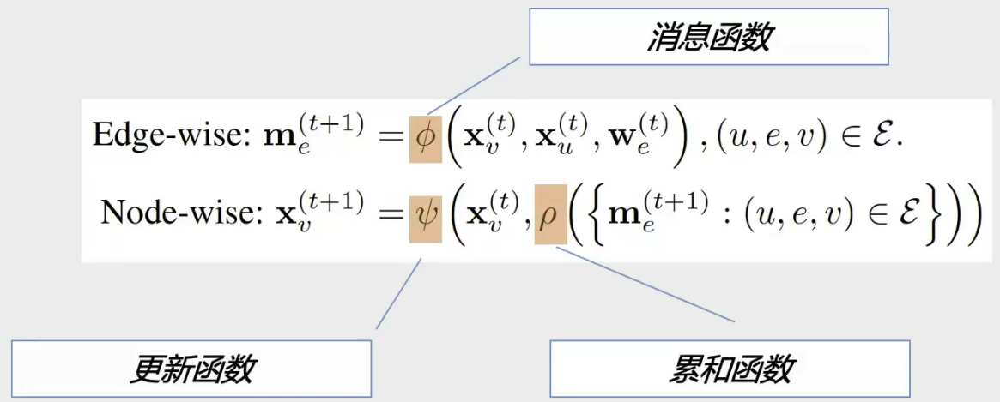

### 框架 Deep Graph Library(DGL)

from 纽约大学(上海)
材料：[https://github.com/dglai](https://github.com/dglai)

接口、底层设计、训练性能、开源社区

### 与DGL相关的常用工具

- 可视化：GNNLens、GTAPHISTRY

- 复杂图：OpenHGNN

- GNN测评标准：OPEN GRAPH BENCHMARK

- 数据库：Amazon Neptune ML，neo4j ,Arango

- 结构化自然源处理：Graph4NLP

- 面向生命科学：DGL-LifeSci，deepchem

- 知识图谱嵌入：DGL-KE

### 其他开源

pyG，graph-learn，Paddle Graph Learning, Jraph

如何让用户用该开源框架：易用 高性能 大规模

### 易用性+高性能

图本身入门门槛较高：
图->不规则数据->规则数据

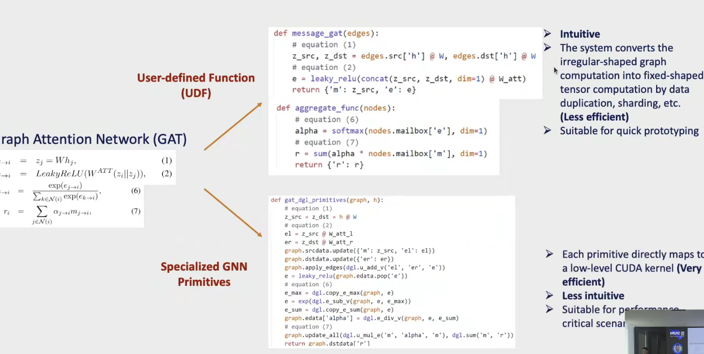

### 大规模问题

- 数据集(工业上百亿级、千亿级数据)：

|Dataset| Nodes | Edges| Node features| train nodes| train links|
|-|-|-|-|-|-|
|OGBN-PRODUCT||| | |
|AMAZON|||||
|OGBN-PAPERS100M|||||
|MAG-LSC|||||

- 小批次训练

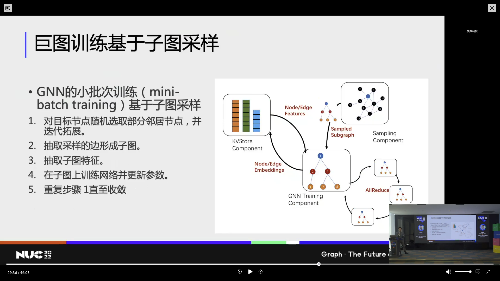

采样（大图中取子图）-> 抽取（子图特指key value store）-> 训练模块（部署在单/多GPU）

cuda uva技术->在CPU上但GPU可见

- 图数据库+DGL

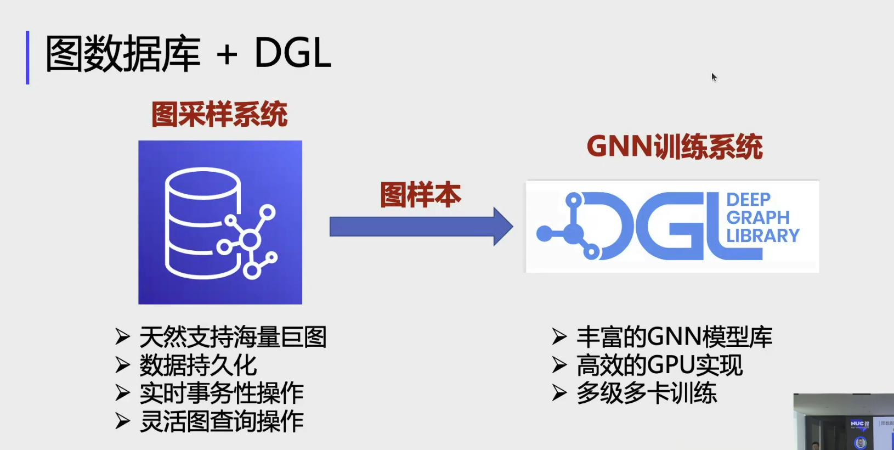

- 成本与代价：

训练成本高
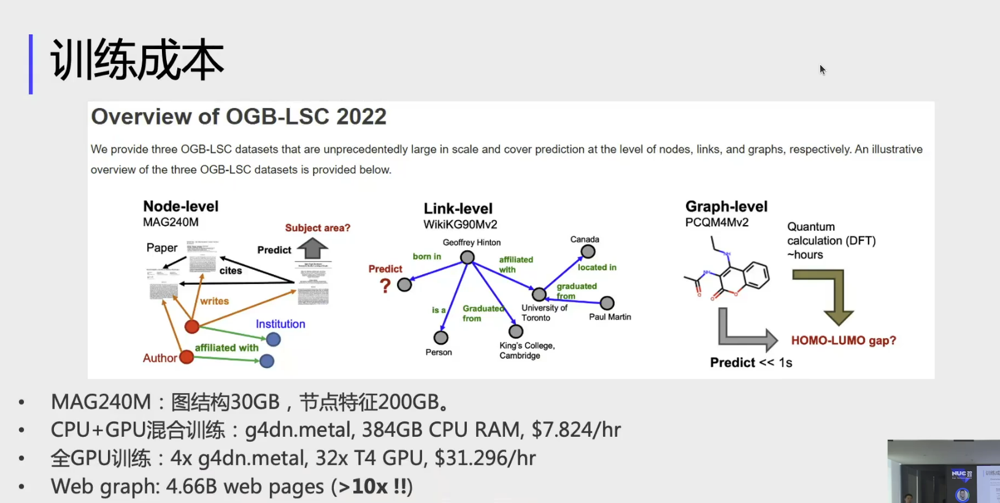

推理成本（边推理+节点推理）
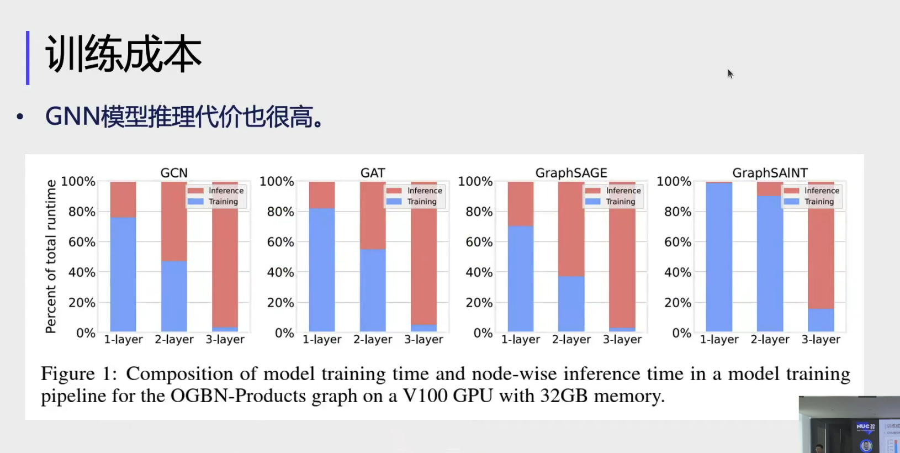

## 总结

[DGL官网](https://www.dgl.ai)

[DGL开源](https://github.com/dmlc/dgl)

----

# 第二节：图数据库在中国移动金融风控领域的落地应用

中国移动算法工程师-王海涛

## 图平台建设概况

已有信息：用户信息、通话信息、短信、设备、流量、停机、设备异常等；
开发：群体停机、设备异常、群体居住地、工作地异常变动，羊毛党预警、共债风险评估——为金融助贷提供服务。->关联风险分、号码风险分、信用评分卡、催收分析；

已有框架：Hadoop大数据平台+JanusGraph图数据库+SparkGraphX图计算引擎，内存环境占用大，运算速度慢，TPS并发量不足。

中国移动图平台建设——新架构
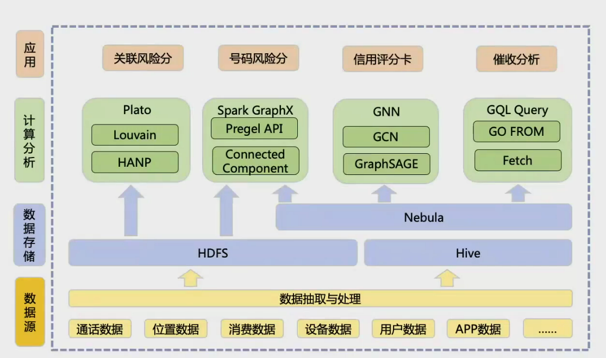

## 图技术应用

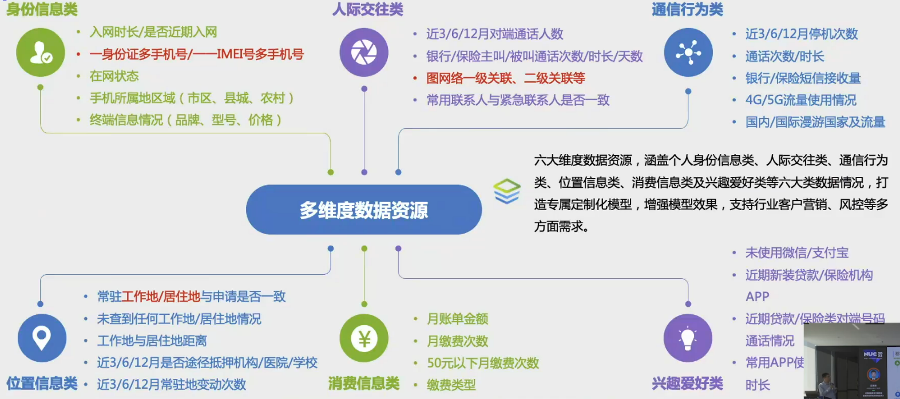

- 应用说明

点数据：手机号、地理位置、身份证、设备

边数据：手机号-手机号（通话）、手机号-身份证（归属）、手机号-设备（设备）、手机号-地理位置（**常变化**）

目的：构建社区网络，查找“行为不规范”、“容易上当”、“贷款风险情况”、“特殊人群（外卖、快递）”等。

- 图神经网络的应用

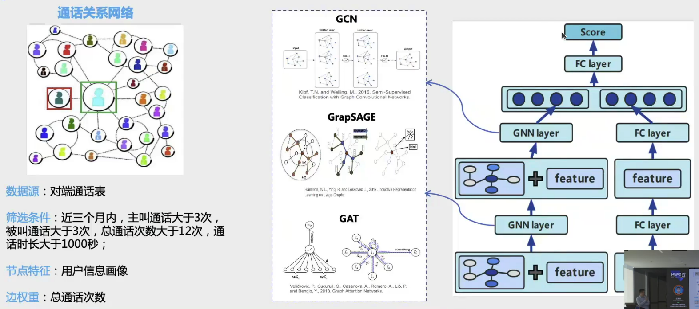

通话关系网络（同构神经网络）
节点：用户信息画像
边：近三个月通话次数

希望构建异构图神经网络（增加身份证、设备等上文中的一些信息）

## 未来展望

1. 数据血缘
数据平台管理混乱

2. 图神经网络
GPU资源，模型训练效率低下

# 第三节：CQL Update 2022图数据库查询语言国际标准GQL进展

NebulaGraph CCO 田忠 博士

## Property Graph 查询语言国际标准介绍

互联、互通、互操作

人才的时代还是数据的时代？数据是新时代的“自然资源”。

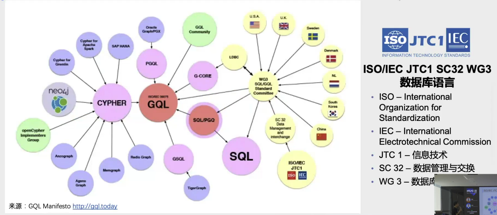

GQL尝鲜

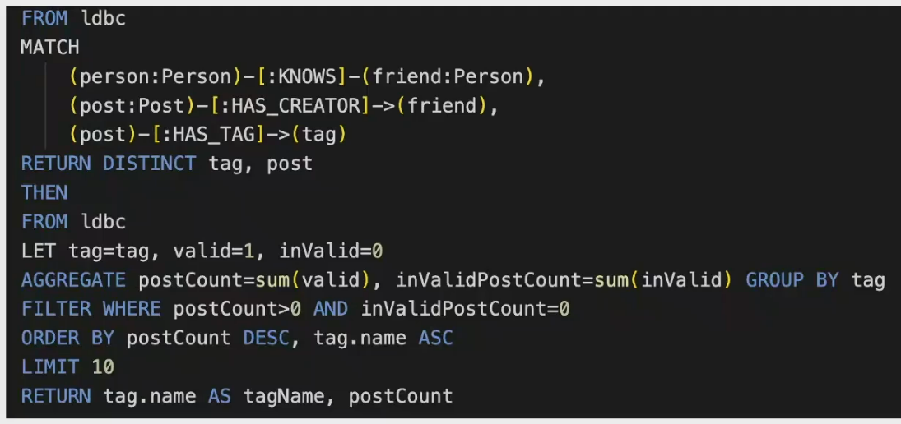

# 第四节 “图”行业的一些观察——以图数据库为例

NeblulaGraph PMC 吴敏 博士

## 知识 + 关联 = 经验

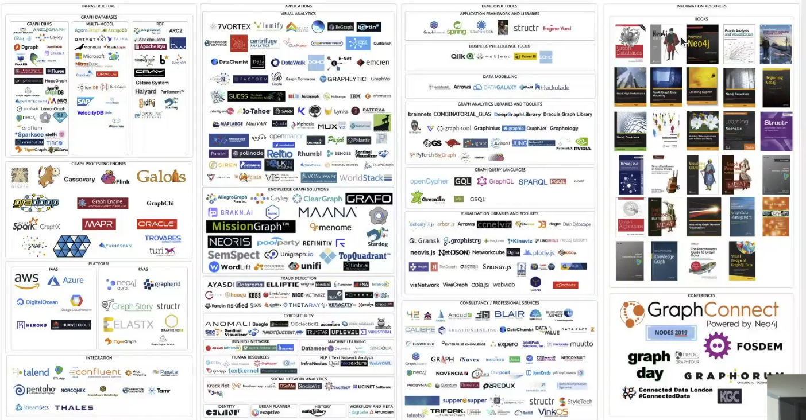

|基础设施|开发者工具|应用|信息|
|-|-|-|-|
|图数据库|数据模型|知识图谱|书籍/出版物|
|图处理引擎|图分析库/图分析工具|欺诈检测网络安全|会议|
|图神经网络|可视化库/可视化工具|社交网络/商业网络分析|组织|
|可视化分析|应用框架和库|identity workflow and meta|GQL标准|
|云供应商|商业情报工具|集成和解决方案||

## 图历史

18年前略 1960s、1970s、2010s

2018 神经网络AI（联接主义）、符号主义（Knowledge Graph）

- 专利迅速增长：Graph Netural Network,Knowledge Graph
- 论文迅速增长
- 图数据库迅速增长

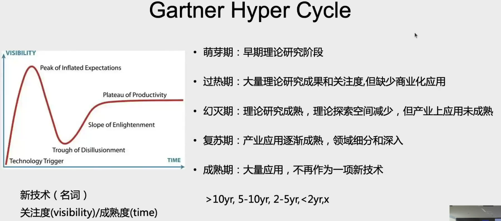

## 图技术发展

- 图模型
- 图可视化
- 图形匹配
- 图计算
- 图数据科学
- 流式处理/时序图处理
- 图神经网络

## 图产品

- 搭建系统的复杂度高，门槛高
- 需要更加集成
- 需要更完备的标准（ISO-GQL,图算法API，工作流，Benchmark）
- 推荐两篇综述：

[The ubiquity of large graphs and surprising challenges of graph processing: extended survey](https://xueshu.baidu.com/usercenter/paper/show?paperid=127j0jg06v4g0m10qk7g0td0g0410987)

[The Future Is Big Graphs: A Community View on Graph Processing Systems](https://xueshu.baidu.com/usercenter/paper/show?paperid=1d0j0rx0fr4n0ph0pg380450yd430484)

# 第五节 知识图谱与图计算研究分享

复旦大学 肖仰华 教授

## 认知能力

三个主义：

- 联结主义 -> 实现人类的快速思考（输入和输出的关联）

- 符号主义 -> 实现人类的慢思考（符号表示与推理）

- 行为主义 or 进化主义 -> 实现认知/交互

## 知识图谱

是一种“表示”方法，也是一种“工程”技术。
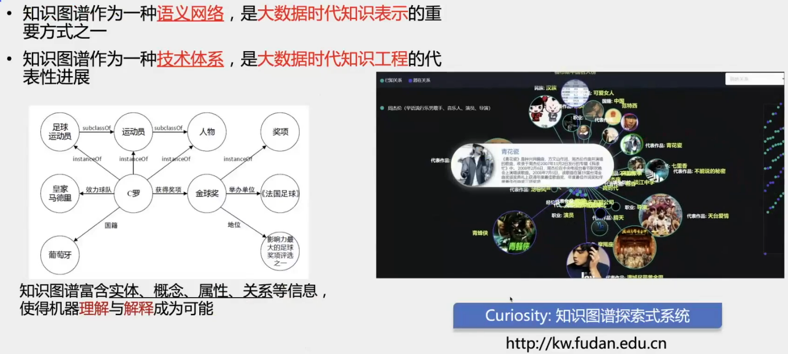

- 知识图谱成为认知智能的基石

  人类认知：【高阶认知】：文化认知、思维认知、语言认知、【低阶认知】：心理认知、神经认知

- 知识图谱的研究意义

  机器语言认知、可解释人工智能

  知识引导成为问题求解方式之一

  知识增强学习能力

- 知识图谱应用层的进化

  搜索->推荐->问答->解释->决策

## 知识图谱管理与应用的挑战

知识图谱类型多样，常见行业中使用：有向图、无向图、属性图、树状图、有向无环图、带权图、异构信息网络

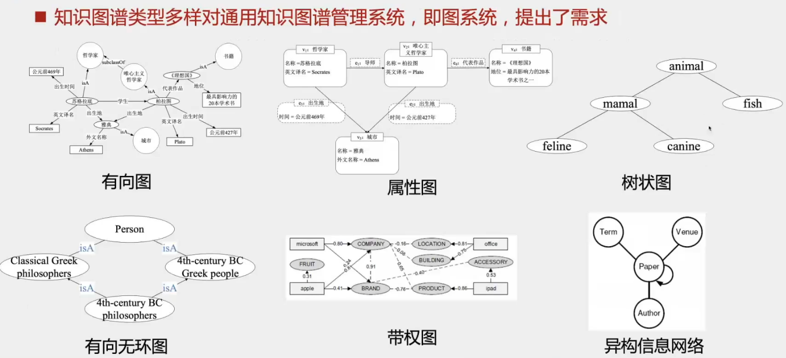

### 知识图数据管理挑战

- 图数据复杂：随机访问、局部性能优化；难实现并行处理；
- 知识图谱多样：领域知识图中数据密度不均衡；实践知识图谱中偏序关系比重大；
- 图谱计算：知识图谱可视化；交互式探索对计算响应速度、数据吞吐量等提出新要求；
- 知识图谱数据规模巨大：十亿个、百亿个三元组

### 应用挑战

- 数据模式复杂且需要非严格限定：知识归属不一定明确，需要有容错能力
- 多值谓词：建模和存储模块能处理多值问题
- 属性值确实：实际数据中缺失相应属性
- 多角色实体处理：无法预先定义实体模式
- 数据和模式的实时更新：反应现实世界的变化
- 逻辑推理：存储和查询性能难度

### 应用场景转变

- 大规模：出行、美食、购物、搜索 -> **单一的应用模式、简单的知识应用、词汇知识和简单事实为主（羊肉卷->容易理解的）、大规模用户数据**
- 小规模：医疗知识图谱、工业知识图谱、司法知识图谱、金融知识图谱 -> **更复杂的场景、深度的知识应用、密集专家知识、有限资源数据；**

### 技术生态变化

- 大模型应用，对基于知识的应用形成替代
    狭义的知识：人类视角中可以看见的知识
    广义的知识：能解决问题的“输入-输出”模式->可以由大模型驱动

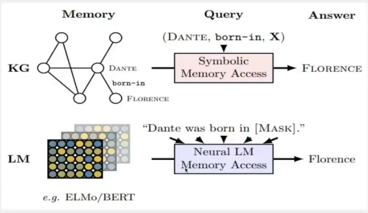

### 成本与效用

- 成本：数据成本、构建成本、运维成本
- 效用：场景不明、锦上添花居多、技术（不成熟）风险

## 图系统支持知识图谱发挥功能

### 从知识表示角度

- 大规模知识图谱分布式表示的高效管理技术

知识图谱的表示学习旨在将知识图谱中的元素（实体、属性等）表示为**低维稠密实值**向量

向量化：面向机器处理
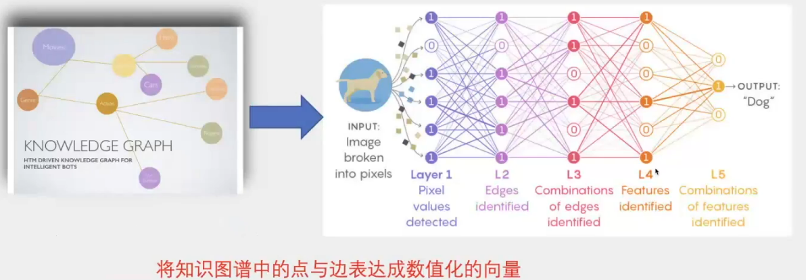

符号化：面向人的理解

符号可实现**符号推理**

- 词汇、概念知识图谱：
    上位词关系（isA 关系），isA(apple，fruit)
    先验知识 isA(Kobe,NBA star),难以进行分类
- 兄弟信息、一词多义等
- 实验：链接预测、关系分类、文本分类：[Liu J , Wang M , Wang C ,et al.Learning Term Embeddings for Lexical Taxonomies[J].  2021.](https://xueshu.baidu.com/usercenter/paper/show?paperid=1b1y0ak01a7602w0ff5m0rp0pd238491)

- 分布式概念原型表示：

**认识** 从具体的a猫，b猫，c猫得到猫的原型，达到认知；

同理：a类图，b类图，c类图得到图的联合应用；

- 向大规模知识网络演进

**认知** 还需要从 本体,框架，逻辑规则，决策，概率；知识图谱，语言模型，多模态模型等混合构建成大规模认知网络：【目前还是单一的，只有知识图谱】

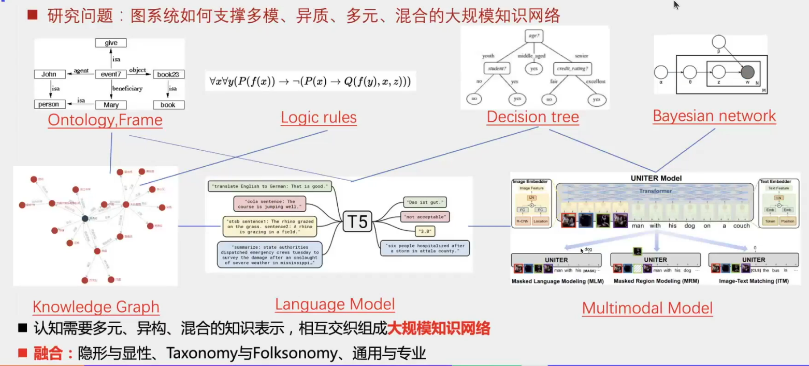

- 与其他规则的结合不方便
- 与大模型等结合不方便

**知识**是：

传统：先表示，再推理

未来：直觉做出，事后解释

### 从知识获取角度

- 基于图模型的概念进行图谱补全（图中，长得像的邻居）
- 基于图模型的概念图谱纠错（去环、获取有向无环图）
- 基于图模型的领域知识图谱精华
- 行为数据驱动的领域知识图谱化

### 从知识管理角度

- 知识图谱的质量评估
    目前大量一次性图谱的建立，而应用产生了一些问题，反向需要完善和评估能力
- 知识库的评估维度
    知识图谱准确性评估（百亿级，采样的评估，从三元组角度和从节点角度）
    知识图谱实时性评估
    知识图谱完整性评估
    知识图谱结构性评估
    知识图谱的冗余性评估（规模大但冗余太多，国籍可以从出生地推出）
    知识图谱的众包构建（激励人力修改；人机协作是图谱项目落地的关键；）

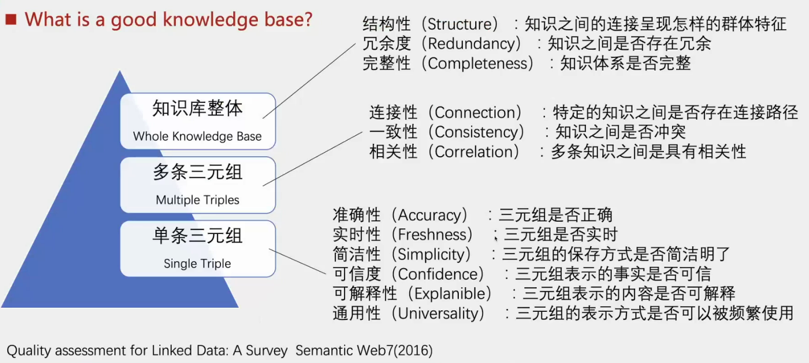

- 预训练模型成为KG的重要知识补充

- 面向语言模型的查询处理（知识荟萃）【评估、查询】

- 面向大规模图神经网络的图计算系统

# 第6节 未来已来

NebulaGraph创始人 叶小萌

## 高速增长的图数据库需求

    应用场景：推荐引擎、智能营销、反欺诈、反洗钱、供应链关系、流程管理、组织架构管理、知识图谱、数据价值挖掘

- 管理从供应端转向消费者（每个用户的汽车的零部件）
- 新领域有了新技术需要图数据库的支持

**Cypher**,PGQL,nGQL,gSQL,GraphQL,Gremlin,Raw API:用户难以选择、难以迁移，学习成本高，难以普及

## 图数据库的应用场景

业务方面：

- 实时关系探索，直接影响实时业务结果；
- 实时异步计算，对数据计算要求比较高；

例如：解决了一些“痛点”：推荐、风控需要实时化、知识图谱数据海量化，更多场景关系及时分析；

分析计算（AP）方面：

- 全图关系分析，对事后进行分析；
- 图算法，与其他大数据不同的地方；

例如：图数据分析是缓解了“痒点而不是痛点”：图计算框架不是不可替代的，在资源利用上无明显优势，增加了大数据系统的运维复杂性；

# 第7节 基于NebulaGraph与GrpahXR的IT系统可视化监管与运维

上海图客科技 GraphXR-图可视化高级工程师 李选贤

## GraphXR简介

业务：GraphXR 三维图可视化及相关业务

银行、航空、地理等场景的使用。

预警：
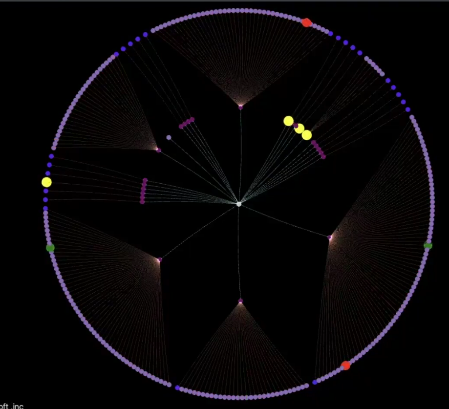

## 演示

略，官网：[上海图客科技有限公司 https://www.graphxr.cn/](https://www.graphxr.cn/)

# 第8节 知识图谱再金融风控场景的应用

同盾科技 软件产品技术负责人 何免

## 云图只是图谱能力平台全景图

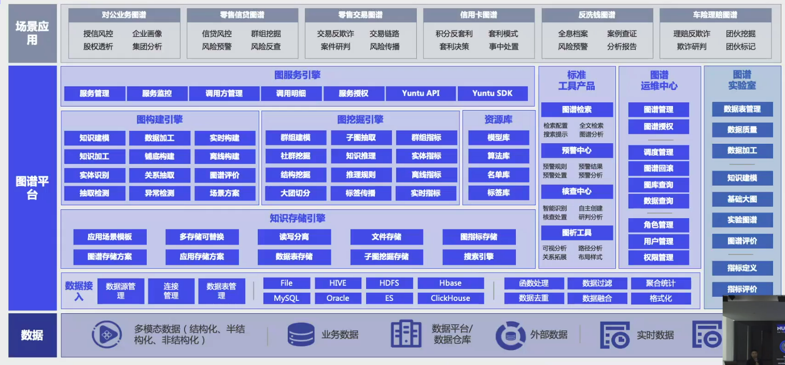

# 第9、10、11 略

> flag:
>
> 2023.8.18 0 0 0
>
> 2023.8.19 0 0 0 0
>
> 2023.8.20 8 9 10 11
